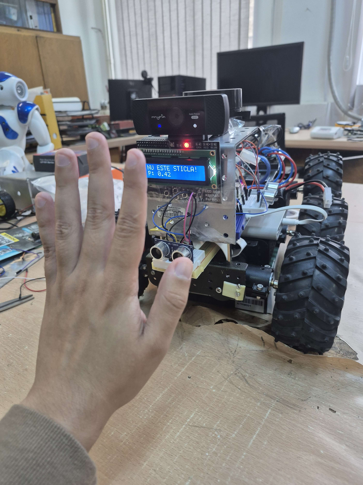
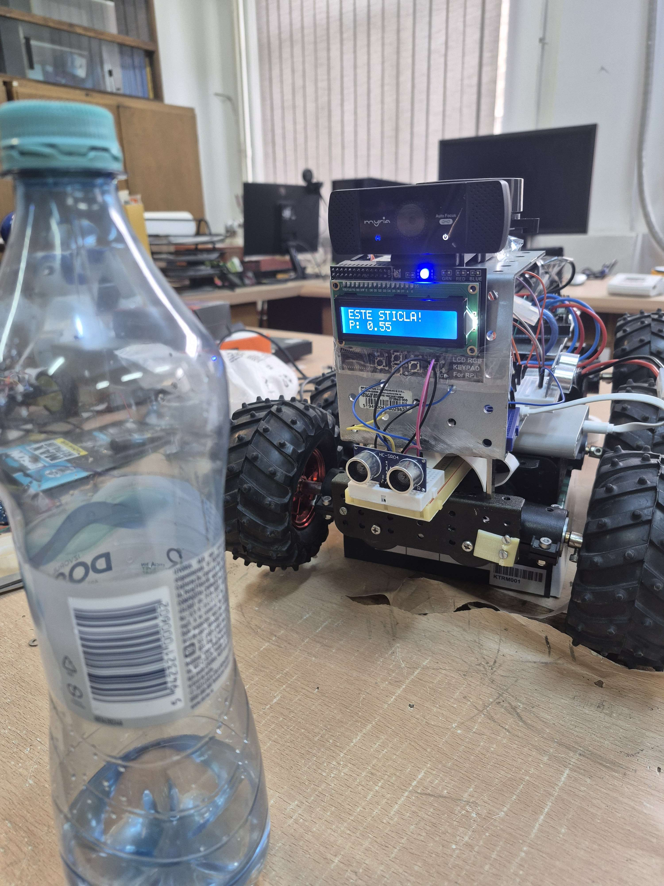

# Autonomous Robot Bottle Detection

## Description
This project showcases an autonomous robot that can detect the presence of a bottle using Deep Learning and display the result on an LCD screen. The main code resides in `project.ipynb` and covers the essential steps for:

- **Loading and Preprocessing Data**  
  - Defining and organizing the image dataset 
  - Applying minimal augmentations (resizing, normalization, color conversion, etc.).

- **Defining and Training the MobileNetV2 Model**  
  - Using transfer learning.
  - Choosing loss functions, an optimizer, and evaluation metrics.  
  - Saving the best model checkpoint based on validation accuracy.

- **Evaluation and Validation**  
  - Splitting data into training, validation, and test sets.  
  - Plotting accuracy and loss curves, as well as confusion matrices.  
  - Tuning hyperparameters (learning rate, number of epochs, batch size, etc.).

- **Real-Time Inference and Hardware Integration**  
  - Capturing video frames from the camera mounted on the robot (e.g., a Myria webcam).  
  - Preprocessing each frame quickly and running inference with the loaded model.  
  - Displaying the result on an LCD (text: “ESTE STICLĂ!” or “NU ESTE STICLĂ!”) along with the probability score.  
  - Controlling motors and using an ultrasonic sensor (HC-SR04) to avoid obstacles automatically when a bottle is detected or not.

- **Hardware Setup**  
  - A Raspberry Pi, a camera module, an LCD with a keypad, and an ultrasonic sensor.  
  - A motorized chassis with wheels, motor drivers, cables, and any required USB hub.  

The notebook (`project.ipynb`) is organized into the following sections:
1. **Imports and Initial Setup** (libraries, dataset paths, model paths)  
2. **Dataset Loading** (reading images, assigning labels)  
3. **Model Construction** (defining CNN layers, dense layers, dropout, etc.)  
4. **Training** (compiling the model, running epochs, saving checkpoints)  
5. **Evaluation** (plotting accuracy/loss, generating validation reports)  
6. **Inference Code** (a function that takes a frame, applies transformations, and returns the predicted label + probability)  
7. **Hardware Integration** (example main loop that reads sensor and camera data, calls the inference function, and drives motors/displays results)

## Requirements
- **Operating System**: Linux (ideally Raspberry Pi OS) or any Linux distribution compatible with Python 3.x  
- **Language**: Python 3.6+  
- **Python Libraries** (install via `pip`):  
  - `tensorflow` or `torch` (depending on the notebook implementation)  
  - `opencv-python` (OpenCV)  
  - `numpy`, `matplotlib`  
  - `RPi.GPIO` (and/or `gpiozero`), `picamera` (if using Raspberry Pi)  
  - Any other dependencies listed in the first cells of `project.ipynb`  

## Screenshots

  
*No Bottle Detection*

  
*Bottle Detection*

## Contact
For questions, suggestions, or collaboration inquiries, feel free to reach out:  
**mariusc0023@gmail.com**
